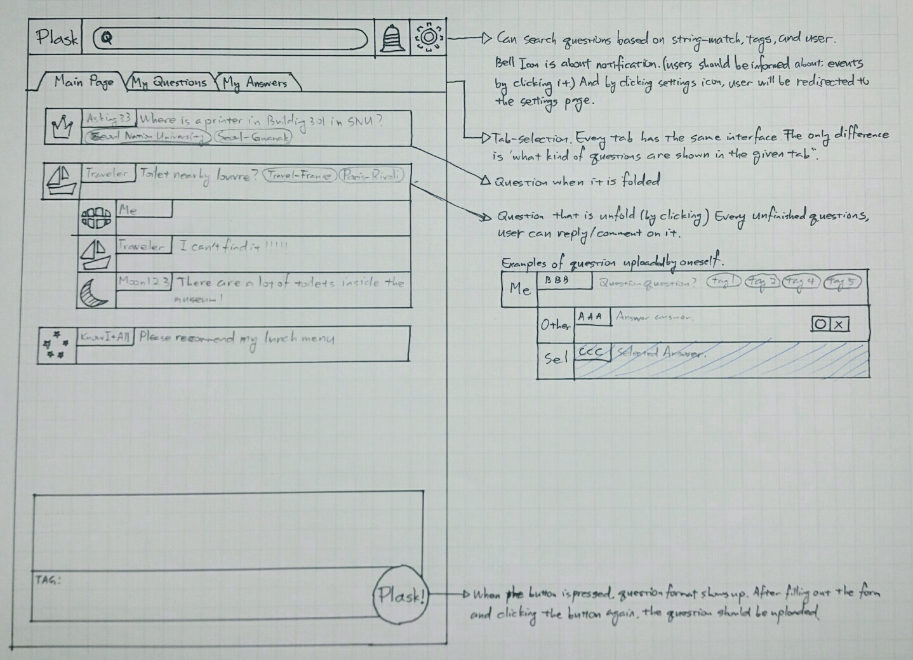

# Project Requirements and Specification
### Location-based live Q&A platform “Plask”

#### Team 6
* Choi Jae hyeok (2012-12666, Dept. of Physics Education)
* Park Jiyeon (2014-18200, College of Liberal Studies)
* Seo Seong Hoon (2015-19410, College of Liberal Studies)
* Yun Heeseung (2015-16890, College of Liberal Studies)

#### Document Revision History
`Rev 1.0 2017-10-23 - Initial Version`

## Project Abstract

"Plask" is a real-time/live Q&A platform for location-based(“localized”) questions. Using Plask, users can easily ask location-specific questions to other users who have the answers to their questions, i.e. to users who actually are in that place.

Despite the fact that we live in the age of information, there are still some information that you just can't satisfiably get by searching web browsers. This is especially the case for location-based questions. Think of a scenario where you want to know if a road is blocked due to construction, or if a specific coffee shop currently has empty seats. Search engines simply do not have those information for the users. Even if they do, there is still a very high chance that the information is not “live” or up-to-date, being valueless for the users.

Now, what if you could ask those same questions to people living or staying in that place? With high chance, you would quickly get the needed information that is valid at that moment. In short, location-based questions can easily and quickly be addressed through collective intelligence of users living in that specific location.

## Customers

Anyone who has questions bound to a specific location can be our user!
In practice, users who frequently move from places to places (could be for travel or business) would be our primary users, along with "local experts" who will actively contribute to the collective intelligence by answering those questions.

We have listed some of the many scenarios where Plask will come in very handy for people.

1. If you were a traveler in London wanting to know if there is a local festival today,

    a. Without Plask: You would have to search “Local festivals in London” and read through several posts about local festivals and check one festival after another if there is one that actually holds place today.
    
    b. With Plask: You could Plask “Is there a local festival in London today?” and any Londoner, or even a knowledgeable traveler, will quickly answer your question. 

2. If you were a student looking for a cafe with electrical outlets,

    a. Without Plask: You would have to go in and out of one cafe after another until you find one with electrical outlets.

    b. With Plask: You could Plask “Is there a cafe with electrical outlets in Nakseongdae?” and a local user who frequently goes to cafe will quickly answer your question.

## Competitive Landscape

### Services that provide a General Q&A Platform

#### 1. [Naver Jisik-iN](http://kin.naver.com/index.nhn)

Jisik-iN is a Q&A platform for all types of questions.

Major Features:

 1) Questions are categorized by topics and can be tagged with keywords.
    
 2) Users can ask questions to experts such as doctors, lawyers, and accountants.
   
 3) Users are given points for asking and answering questions.

### Services that provide location-based Information

#### 1. [Yelp](https://www.yelp.com/sf)

Yelp is a service with the purpose of "Connecting People with great local businesses."

Major Features:

 1) Users fill out “Find:( ) Near:( )” format to search for specific services 
    in a designated location.
    
 2) Users interact with each other by writing reviews about local businesses.
 
 3) Businesses can set up their own accounts to post information
    and communicate with users.

### Services that share the "location-based Q&A" functionality
#### 1. [LocalMind](https://www.crunchbase.com/organization/localmind)
Major Features:

  1) Connection with existing check-in services (sign in, location pinpointing)

  2) Shows nearby users based on check-in services and can send questions to them.
    (ex) Crescent Street - live localminds, one expert localmind available

#### 2. [Loqly](https://www.crunchbase.com/organization/loqly)
Major Features:
    1. local-based questions tied to specific businesses
        Search Keyword --> Show local businesses related 
                                    --> Ask questions about a particular business
        ex) Pasta --> Show list of Italian Restaurants 
                         --> Ask questions about a specific restaurant. 
    2. General Recommendations Q&A

#### 3. [CrowdBeacon](https://www.crunchbase.com/organization/crowdbeacon)

Crowdbeacon was a location-based service helping users answers questions by directing them to local experts nearby.

### How Plask is Different from existing Services
    
#### 1. Convenience and Simplicity:

We believe that location-based questions are also very much bound to the time being asked. For instance, a recommendation for a coffee shop might change if some shops close on Mondays. Also, recommendation for public transportation might change depending on the time of the day. One might recommend bus during the day, but subway for the evening since many people get off work during the evening.

Also, many of the questions are not of significant importance to be stored. They are usually one-time questions that the asker does not need to keep hold of the information once the question is solved.

Thus, compared to other services we will minimize our user interface and functionality to focus on the Q&A and make the user experience as simple as possible.

#### 2. Achieving Real-time through Active Tag System.

Minimizing the time delay between asking a question and receiving an answer is pivotal in this service. This is due to the fact that many questions are asked impromptu, yet requires an immediate addressing. For example, if one wants to know if a road is blocked due to a festival, he or she is probably already on the road and has to be informed quickly before deciding to make a turn or not.

Thus, our service aims real-time Q&A through Active Tag System. Instead of redirecting questions based on pure user-location, a user can actively tag him/herself with "location" tags and "service" tags that he or she is comfortable with answering (i.e. a "local expert"). Asker will also tag the question with location and service tags. Through this feature, we can efficiently redirect questions to users who have the same or closest, tags. This will increase the chance of a question being sent to users who actually can answer, thus increasing the chance of a question being answered. 

## User Stories

#### F1: User can sign up the Plask Web service.
Scenario: Sign Up
1) Given I am on the Plask Start Page.
2) And I should see the “Sign In” and “Register” button and also I should see Inputs for “ID” and “password”.
3) When I press “Register” button.
4) Then I should be in the Plask Sign-Up page.
5) And I should see the Inputs for “email address”, “password”, “password confirm” and “nickname”, the inputs for “location tags” and “service tags” and the “Let’s start” and “Cancel” button.
6) And I put “iluvswpp@snu.ac.kr” to “email address”, “swppishard123” to “password”, “swppishard” to “password confirm” and “swpp apprentice” to “nickname” and I add tags to “locations tags” and “service tags”<F10-2>
7) When I press “Let’s start” button.
8) Then I should be on the Plask Main Page
(Sprint 2)
 
#### F1-1: Plask web service prevents the invalid sign up of user
Scenario: Handle Error when Signing Up
1) Given I am on the Plask Sign-Up page with already put “iluvswpp@snu.ac.kr” to “email address” and “swppishard123” to “password” <middle process of F1-6)>
2) And I put “swppissosimple” to “password confirm” and “swpp apprentice” to “nickname”
3) When I press “Let’s start” button
4) Then I should see the message “Overlapped nickname, Put the other nickname” is on the below of “nickname”
5) And I should see the message “Password match failed” is on the below of “password confirm”
6) And I should see the message “Put your location tags for pushing question” is on the below of “location tags”
(Sprint 2)
 
#### F2: User can sign in the Plask Web service with ID and password
Scenario: Sign In
1) Given I am on the Plask Start Page and I should see its includes<F1 - 2>
2) When I put “iluvswpp@snu.ac.kr” to “ID” and “123123” to “password” then press the “Sign In” button.
3) Then I should see the message “Invalid email address or password” on the below of the Input “password”
4) And I should see the “iluvswpp@snu.ac.kr” in “ID” and empty Input “password”
5) When I put “swppishard123” to “password” then press the “Sign In” button
6) Then I should be on the Plask Main Page
(Sprint 2)
 
#### F3: User can change settings of location for notification
Scenario: Change Settings
1) Given I am on the Plask Main Page
2) Then I should see “Setting” button on the top of the page
3) When I press “Setting” button
4) Then I should be in the Plask Settings page
5) And I should see my current tags of location
6) When I click “change my tag” button
7) Then I should be able to add or delete tags<F10-2)>
(Sprint 2)
 
#### F4: User can change frequency of notification about new question
Scenario: Change notification frequency at settings tab
1) Given I am on my settings page <F3-4)>
2) And I should see my current notification frequency setting
3) When I click frequency change button
4) Then I should be able to choose numbers between 0 to certain number
5) When I choose 5 and press confirm button
6) Then I am on my settings page with updated frequency information.
(Sprint 2)
 
#### F5: User can switch tabs in the Plask main page
Scenario: Switch Tab
1) Given I am on the Plask Main Page with “Main” tab (default tab)
2) And I should see its content and “Add question button” <F6 – 2), 3)>
3) When I follow “My Answers” tab
4) Then I should be on the Plask Main Page with “My Answers” tab
5) And I should see its content and “Add question button”
6) When I follow “My Question” tab
7) Then I should be on the Plask Main Page with “My Question” tab
(Sprint 3)
 
#### F6: User will be notified with new questions related to user’s tags and user can see the latest questions
Scenario: Get Notified With Question and Latest Question
1) Given I am on the Plask Main Page with “Main” tab <F5 – 1)>
2) And I should see the new questions which are asked by other users and are sharing one or more of my tags.
3) And I should see the “Find Question” search box
4) When I press the search box
5) Then I should see the cursor is on the search box and the list of latest questions.
(Sprint 3)
 
#### F7: User can search the question with tags.
Scenario: Search Question
1) Given I am on the Plask Main Page with “Main” tab and pressing the search box <F6 – 4)>
2) When I insert “SNU, Cafeteria” in the search box
3) Then I should see the latest questions have the tag “SNU” or “Cafeteria” including the question “Where is the college of agriculture and life science’s cafeteria?”
4) When I press the question “Where is the college of agriculture and life science’s cafeteria?”
5) Then I see the recommendation list<F6 – 2)> is changed to the question “Where is the college of agriculture and life science’s cafeteria?” and its answer list.
(Sprint 3)
 
#### F8: View the Details of a Question
Scenario: View the full detail of the selected question
1) Given I am on the Pask Main Page with any tab <F5 - 1), 4), 7)>
2) When I click on a particular question
3) Then I should see the full information about the question (“expand”)
4) And I should see the full list of responses below the question
5) When I click the question box once again
6) Then the question should return to its original state (“collapse”)
(Sprint 3)
 
#### F9: Respond to New Notifications
Scenario: See question or answer by alarm
1) Given I am on the Plask Main Page with any tab <F5 – 1), 4), 7)>
2) And I should see the alarm on “Alarm” icon
3) When I press the “Alarm”
4) Then I should see the Plask Main Page with alarm list which includes both my question reply alarm and my answer reply alalm
5) When I press the question “Where is the Coffee Bean around the Seoul Nat’l Univ. Station?” which I asked before
6) Then I should be on the Plask Question Page of question “Where is the Coffee Bean around the Seoul Nat’l Univ. Station?” <F8 - 4)>
(Sprint 4)
 
#### F10: Add Tag
Scenario: Select or create tag in adding question
1) Given I am on the Plask Tag selecting page <F11 - 5), F3 - 6)>
2) And I select "Seoul”, “Gwanak Gu”, “Naksungdae Station" from "Tag-Location"
3) And I type “Cafe” in “Tag-More – need to rename”
4) Then I should be recommended with “Coffee Bean”, “Tom and Toms”, “Cafe”, “Angel-in-us” Tags in “Tag-More”
5) And I select “Coffee Bean” with pressing it
6) And I create tag as “Quiet Cafe” in “Tag-More” with typing and clicking.
7) And I delete tag “Quiet Cafe” with press the ‘X’ button of the tag
8) Then I should see the tag list of "Seoul”, “Gwanak Gu” and “Naksungdae Station” which is in “Tag-Location”, and also I should see tag list of “Coffee Bean” which is in “Tag-More.”
(Sprint 4)
 
#### F10-1: Handle error with Add Tag
Scenario: Try to add same tag into one question
1) Given I am on the Plask Tag selecting page <F11 - 5), F3 - 6)>
2) And I select "Seoul”, “Gwanak Gu”, “Naksungdae Station" from "Tag-Location"
3) And I type “Cafe” in “Tag-More – need to rename”
4) And I type “Cafe” in “Tag-more” one more times
5) And I clicked somewhere to finish tag adding
6) Then I have only one “Cafe” in “Tag-More”
7) And I should see the message “Duplicate Tag”
(Sprint 4)
 
#### F11: Ask Questions
Scenario: Add question
1) Given I am on the Plask Main Page with any tab. <F5 – 1), 4), 7)>
2) When I follow "Add new question"
3) Then I should see the Create New Question box
4) When I fill in “Content” with “Is there an electric outlet in cafe Coffee Bean?”
5) And I select tags with recommendation <F10>
6) And I press "Post Question"
7) Then I should be on the Plask Main Page with my question
(Sprint 4)
 
#### F11-1: Handle error with Asking Question
Scenario: Trying to ask question without content
1) Given I am on the Plask Main Page with any tab. <F5 – 1), 4), 7)>
2) When I follow "Add new question"
3) Then I should be on the Create New Question page
4) When I fill nothing in “Content”
5) And I press "Post Question"
6) Then I should see the message “Please fill the content”
(Sprint 4)
 
#### F12: Answer Questions
Scenario: Answer a question in “My Question” Tab
1) Given I am see that question with any tab <F5 - 1), 4), 7)>
2) When I click on that question
3) Then I should see an “Answer Box” below the question with a “Send” Button
4) When I write my answer in the Answer Box
5) And press the send button
6) Then I should see my answer attached to the question.
(Sprint 5)
 
#### F12-1: Handle error with Answer Question
Scenario: Trying to add answer without content
1) Given I am see that question with any tab <F5 - 1), 4), 7)>
2) When I click on that question
3) Then I should see an “Answer Box” below the question with a “Send” Button
4) When I write nothing in Answer Box
5) And I press the send button
6) Then I should see the message “Please fill the content”
(Sprint 5)
 
#### F13: See "My Answers”
Scenario: View questions in “My Answers” Tab
1) Given I am on the Plask Main Page with “My Answers” Tab <F5 - 4)>
2) Then I should see the list of questions that I have answered before.
3) When I click on a particular question from the list
4) Then I should see the detail of that question <F8>
(Sprint 5)
 
#### F14: See "My Questions”
Scenario: View questions in “My Questions” Tab
1) Given I am on the Plask Main Page with “My Questions” Tab <F5 - 7)>
2) Then I should see the list of questions that I have asked before.
3) When I click on a particular question from the list
4) Then I should see the detail of that question <F8>
(Sprint 5)

#### User stories distribution
* Sprint 2 : F1, F1-1, F2, F3, F4
* Sprint 3 : F5, F6, F7, F8
* Sprint 4 : F9, F10, F10-1, F11, F11-1
* Sprint 5 : F12, F13, F14

## User Interface

(Some non-essential functionalities that are only for entertaining including ‘Icon shop’, ‘Rewards system’, etc might be added in the future sprints.)

1. UI of sign-in page, register page and setting page

2. UI of main page and its description

